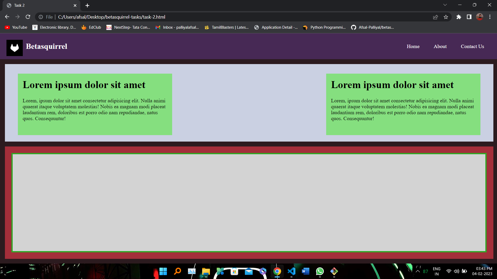
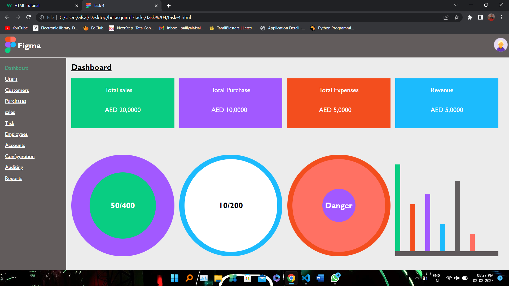
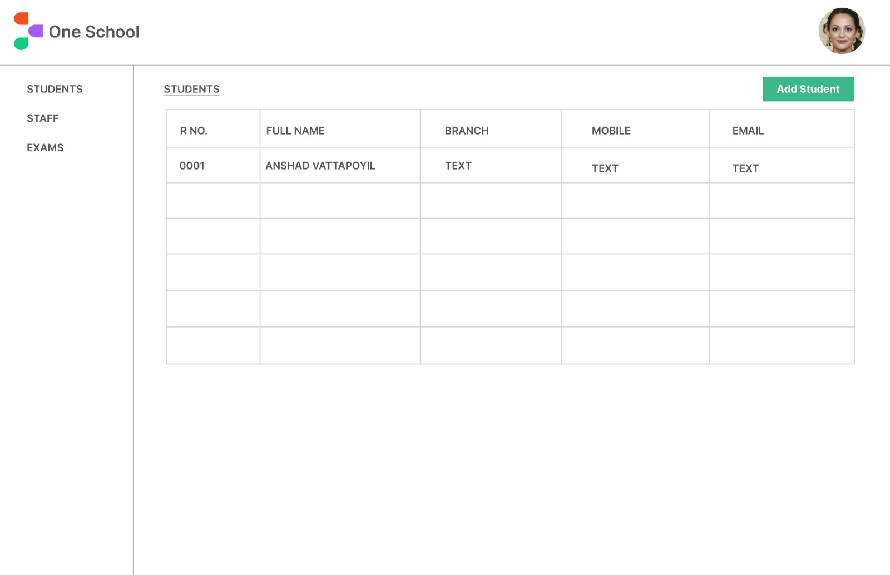
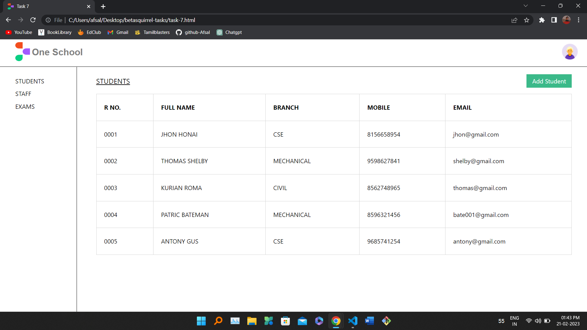

# betasquirrel-tasks

Assignments from betasquirrel

## Live Demo

- [TasksView](https://afsal-palliyal.github.io/betasquirrel-tasks/)

## Websites

- [GitHub](https://github.com/Afsal-Palliyal)
- [Linkedin](https://www.linkedin.com/in/afsal-p-28775225a)
- [Stack Overflow](https://stackoverflow.com/users/21194134/afsal-p?tab=profile)

## Figma Design

- [Carwash Desktop](https://www.figma.com/file/KAq4DS65aXU0EtZ6bDq0bM/Car-wash-website-desktop?node-id=0%3A1&t=NeT8wGxIdmyV6JrD-1)
- [Carwash Mobile](https://www.figma.com/file/B2ThnNA3ck9XfAvfVtPgAk/Car-wash-website-mobile?node-id=0%3A1&t=V7xQNsnvVC7dr5c2-1)

## Tasks

| Requirements                 | Output                        |
| ---------------------------- | ----------------------------- |
|  |  |
|  |  |
|  |  |
|      |  |
|  |  |

## Linux Commands

- `cd` - Change current directory. Ex: `cd Desktop`, `cd ..`
- `ls` - List contents of a directory. Ex: `ls -a` lists hidden files as well.
- `pwd` - Display current working directory path.
- `cat` - Display contents of a file. Ex: `cat README.md`

## Git Commands

1. `git config` - Configure git user. Ex: `git config --global user.name "Afsal-Palliyal"`, `git config  --global user.email "palliyalafsal@gmail.com"`
2. `git clone` - Clone a remote git repo to your local. Ex: `git clone https://github.com/Afsal-Palliyal/betasquirrel-tasks.git`, `git clone https://github.com/Afsal-Palliyal/betasquirrel-tasks.git new-folder`
3. `git add` - Add your file changes to git. Ex: `git add .`, `git add README.md`
4. `git commit` - Commit changes to git. Ex: `git commit -m "Initial commit"
5. `git push` - Push your local commits to remote repo. Ex: `git push origin main`
6. `git pull` - Pull updates your current local working branch. Ex: `git pull new-folder`
7. `git reset --hard` - To remove the changes except folders.
8. `git status` - To see the current changes as list.
9. `git diff` - See the changes on each file.
10. `git log` - See commit history.
11. `git stash` - Stash your uncommitted changes.

## Task 3

Read the below links and attend exercises.

- [HTML HOME](https://www.w3schools.com/html/default.asp)
- [HTML Introduction](https://www.w3schools.com/html/html_intro.asp)
- [HTML Editors](https://www.w3schools.com/html/html_editors.asp)
- [HTML Basic](https://www.w3schools.com/html/html_basic.asp)
- [HTML Elements](https://www.w3schools.com/html/html_elements.asp)
- [HTML Attributes](https://www.w3schools.com/html/html_attributes.asp)
- [HTML Headings](https://www.w3schools.com/html/html_headings.asp)
- [HTML Paragraphs](https://www.w3schools.com/html/html_paragraphs.asp)
- [HTML Styles](https://www.w3schools.com/html/html_styles.asp)
- [HTML Formatting](https://www.w3schools.com/html/html_formatting.asp)
- [HTML Quotations](https://www.w3schools.com/html/html_quotation_elements.asp)
- [HTML Comments](https://www.w3schools.com/html/html_comments.asp)
- [HTML Colors](https://www.w3schools.com/html/html_colors.asp)
- [HTML CSS](https://www.w3schools.com/html/html_css.asp)
- [HTML Links](https://www.w3schools.com/html/html_links.asp)
- [HTML Images](https://www.w3schools.com/html/html_images.asp)
- [HTML Id](https://www.w3schools.com/html/html_id.asp)
- [HTML Classes](https://www.w3schools.com/html/html_classes.asp)

## Task 5

- [HTML Favicon](https://www.w3schools.com/html/html_favicon.asp)
- [HTML Tables](https://www.w3schools.com/html/html_tables.asp)
- [HTML Table Borders](https://www.w3schools.com/html/html_table_borders.asp)
- [HTML Table Sizes](https://www.w3schools.com/html/html_table_sizes.asp)
- [HTML Table Headers](https://www.w3schools.com/html/html_table_headers.asp)
- [HTML Table Padding & Spacing](https://www.w3schools.com/html/html_table_padding_spacing.asp)
- [HTML Table Colspan & Rowspan](https://www.w3schools.com/html/html_table_colspan_rowspan.asp)
- [HTML Table Styling](https://www.w3schools.com/html/html_table_styling.asp)
- [HTML Table Colgroup](https://www.w3schools.com/html/html_table_colgroup.asp)
- [CSS Table Borders](https://www.w3schools.com/css/css_table.asp)
- [CSS Table Size](https://www.w3schools.com/css/css_table_size.asp)
- [CSS Table Alignment](https://www.w3schools.com/css/css_table_align.asp)
- [CSS Table Style](https://www.w3schools.com/css/css_table_style.asp)
- [CSS Table Responsive](https://www.w3schools.com/css/css_table_responsive.asp)

## JavaScript

- [JS HOME](https://www.w3schools.com/js/default.asp)
- [JS Introduction](https://www.w3schools.com/js/js_intro.asp)
- [JS Where To](https://www.w3schools.com/js/js_whereto.asp)
- [JS Output](https://www.w3schools.com/js/js_output.asp)
- [JS Statements](https://www.w3schools.com/js/js_statements.asp)
- [JS Syntax](https://www.w3schools.com/js/js_syntax.asp)
- [JS Comments](https://www.w3schools.com/js/js_comments.asp)
- [JS Variables](https://www.w3schools.com/js/js_variables.asp)
- [JS Let](https://www.w3schools.com/js/js_let.asp)
- [JS Const](https://www.w3schools.com/js/js_const.asp)
- [JS Operators](https://www.w3schools.com/js/js_operators.asp)
- [JS Arithmetic](https://www.w3schools.com/js/js_arithmetic.asp)
- [JS Assignment](https://www.w3schools.com/js/js_assignment.asp)
- [JS Data Types](https://www.w3schools.com/js/js_datatypes.asp)

## PHP

- [PHP Intro](https://www.w3schools.com/php/php_intro.asp)
- [PHP Install](https://www.w3schools.com/php/php_install.asp)
- [PHP Syntax](https://www.w3schools.com/php/php_syntax.asp)
- [PHP Comments](https://www.w3schools.com/php/php_comments.asp)
- [PHP Variables](https://www.w3schools.com/php/php_variables.asp)
- [PHP Echo/Print](https://www.w3schools.com/php/php_echo_print.asp)
- [PHP Data Types](https://www.w3schools.com/php/php_datatypes.asp)
- [PHP Strings](https://www.w3schools.com/php/php_string.asp)
- [PHP Numbers](https://www.w3schools.com/php/php_numbers.asp)
- [PHP Math](https://www.w3schools.com/php/php_math.asp)
- [PHP Constants](https://www.w3schools.com/php/php_constants.asp)
- [PHP Operators](https://www.w3schools.com/php/php_operators.asp)
- [PHP If...Else...Elseif](https://www.w3schools.com/php/php_if_else.asp)
- [PHP Switch](https://www.w3schools.com/php/php_switch.asp)
- [PHP Loops](https://www.w3schools.com/php/php_looping.asp)
- [PHP Functions](https://www.w3schools.com/php/php_functions.asp)
- [PHP Arrays](https://www.w3schools.com/php/php_arrays.asp)
- [PHP Superglobals](https://www.w3schools.com/php/php_superglobals.asp)

## Notes

- `rm -rf filename` - remove the file.
- `ssh-keygen` - generate ssh file.
- `position-fixed` - to fix an area static.
- `vh` - viewport height.
- `../` - to back a folder.
- `source code` - hosting -> server.
- `server`-GoDaddy,AWS,GCP,Azure - Cloud/Hosting Provider.
- `IP address` - Purchase domain from domain registar.

## Laravel

- `php artisan serve` - for running view page in laravel.
- `php artisan make:controller StudentController` - for making a controller called StudentController.
- `compact` - for directing from controller(app\http) to view(resourses).
- `route` - called as reverse routing ie instead of using url helper fn give name to route and use it.
- `php artisan make:migration create_users_table --create=users` - for creating data's to database.
- `php artisan migrate` - for pushing it to database.
- `php artisan migrate:rollback` - for further changes deleting existing data's onetime ie go to one step backwards.
- `php artisan migrate:fresh` - for further changes deleting all the existing data's from database.
- `php artisan make:migration alter_users_table --table=users` - for altering or changing any data.
- `php artisan make:seeder UserTableSeeder` - create a seeder named UserTableSeeder.
- `php artisan db:seed` - for putting values, it is possible with $this->call(UserTableSeeder::class) in DatabaseSeeder.
- `php artisan db:seed --class=UserTableSeeder` - without $this->call(UserTableSeeder::class) in DatabaseSeeder.
- `php artisan migrate --seed` - for doing both migration and seeding simultaneously with $this->call(UserTableSeeder::class) in DatabaseSeeder.
- `$users = User::all();` - for fetching all the data from database.
- `$users = User::find(67);` - for fetching the 67th id data from database.
